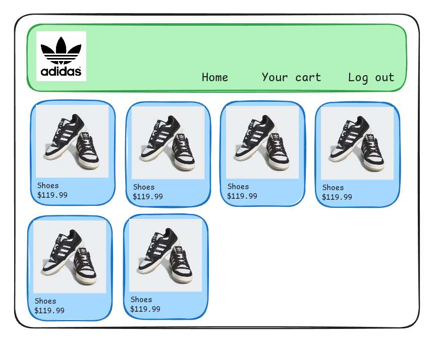
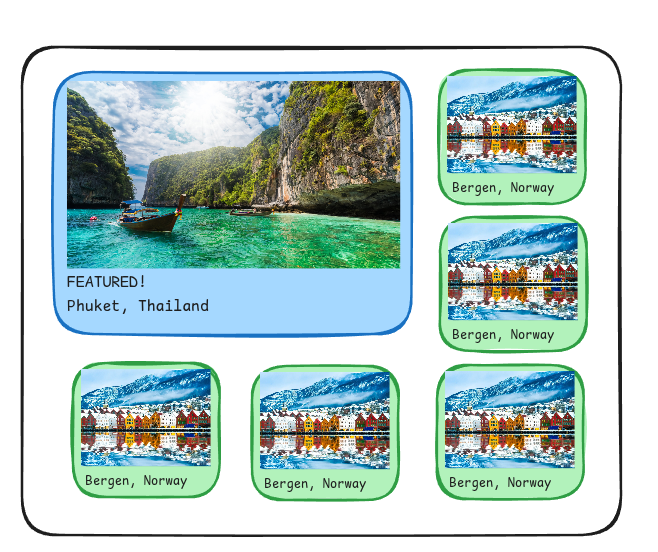

## Task 1: Flex practice

Pretend you are creating a web store.

Create a horizontal navigation bar with a logo on the left and menu items on the right. Use flex to help you with the alignment.

Use flex to create a list of product "cards". Card-like elements which display an image of a product with a name and a price. Use flex to line them up in rows, and use flex-wrap so they automatically go into a new row if they run out of room.

Hint: Set a fixed width on all the images to keep things looking nice and even.

It might look something like this, but feel free to exercise creative freedom, and don't be afraid to fail:

# Task 2: Grid practice

Pretend you have a travel website.

Display some "travel packages" in a grid.
Similar to the product cards, they can also be represented as elements which appear as card.

There should be six travel packages, with one "featured" package that spans two columns AND two rows,
so that you have a layout like this:

It might look something like this, but feel free to exercise creative freedom, and don't be afraid to fail:

